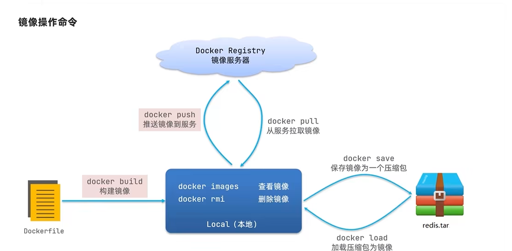
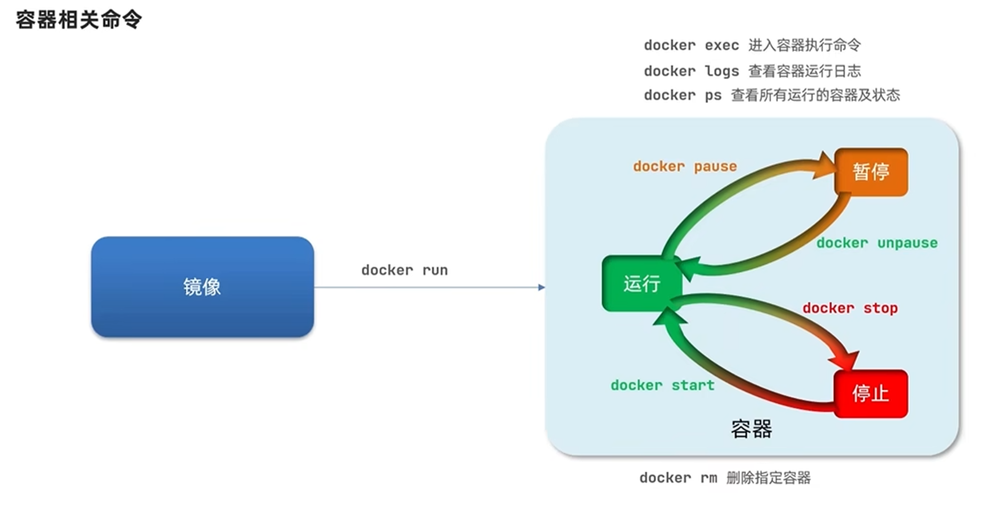
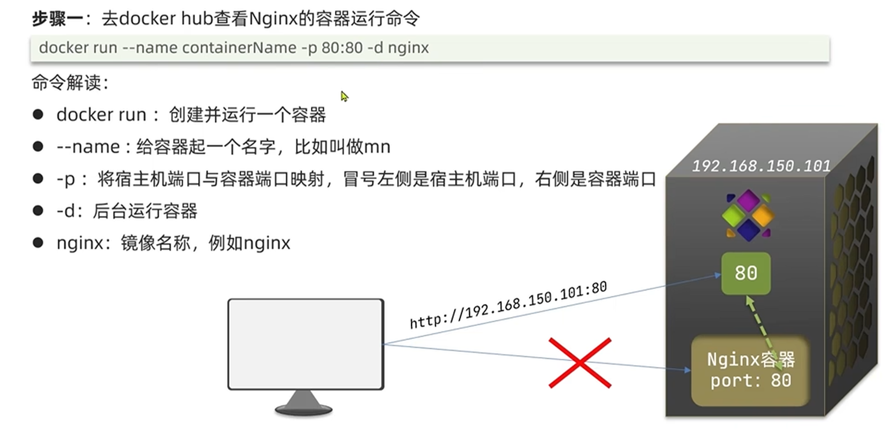
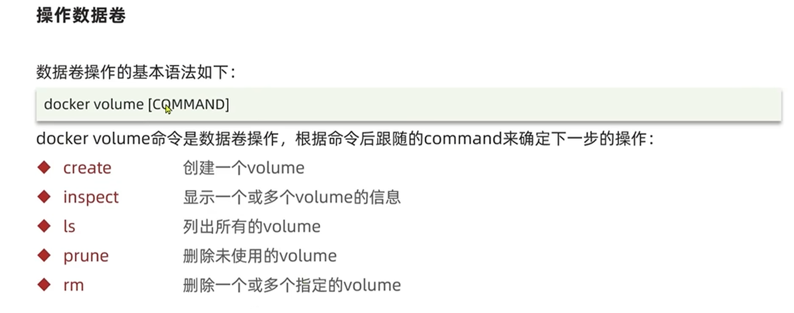

拉取nginx镜像
~~~
docker pull nginx
~~~

查看docker目前有哪些镜像
~~~
docker images
~~~
把一个镜像导出tar压缩文件
~~~
docker save -o nginxfromdocker.tar nginx:latest

~~~
删除一个镜像
~~~
docker rmi nginx:latest 

~~~
加载tar包的镜像
~~~
docker load -i nginxfromdocker.tar
~~~

创建一个容器

查看有哪些容器
~~~
docker ps
~~~

查看某个容器的日志
~~~
docker logs mynginx
~~~

