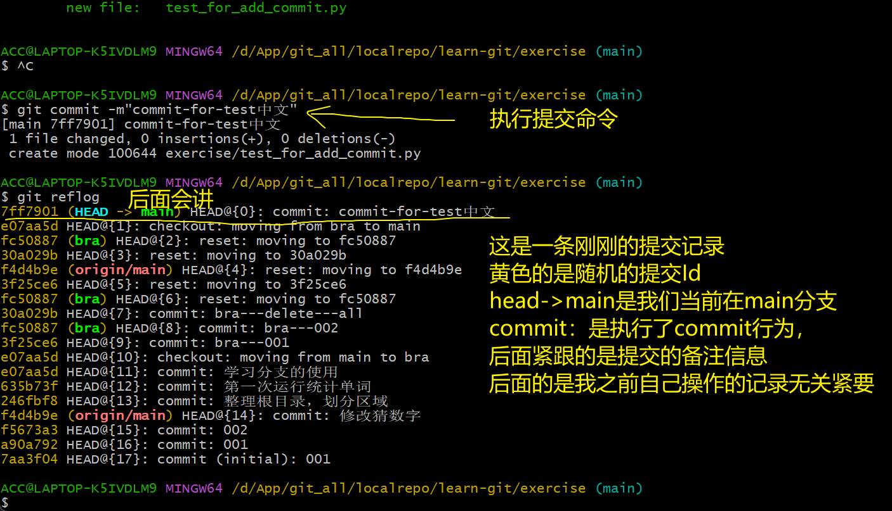
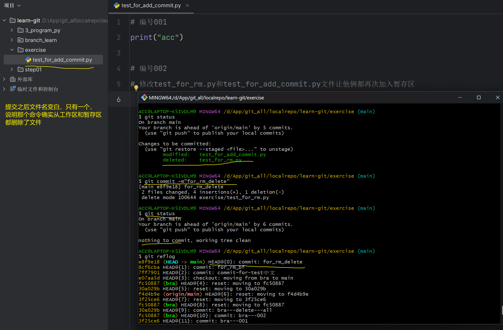

>前提安装好了git并且初始化一个仓库和自己的GitHub账号建立了链接

我的localrepo目录是本地的最大git仓库，旗下的learn-git已经和我GitHub建立链接，主要看目录下的exercise，之后的操作都会在这里
## 最基本的添加和提交
>将一个文件添加到暂存区（绿线的都是知识点，一般紧接着会跟上一个代码）
~~~
git add file-name
~~~
> 将当前目录下所以文件添加到到暂存区
~~~
git add .
~~~
>提交所以暂存区的文件到仓库（massage:是要输入的提交备注信息可中文）
~~~
git commit -m"massage"
~~~
>提交所有已修改的文件到仓库（我一般不用）
~~~
git commit -am"message"
~~~
实操 
我使用pycharm在目录下新建文件test_for_add_commit.py

执行命令---- git add test_for_add_commit.py

执行命令-----git commit -m"commit-for-test中文"

## 查看git的一些信息
>列出还未提交的新的活修改的文件
~~~ shell
git status
~~~
>查看提交历史
~~~ shell
git log --all --pretty=oneline --abbrev-commit --graph
~~~
>查看全部操作日志
~~~ shell
git reflog
~~~
实战
执行命令 ---- git status

之前我只是在pycharm里新建了一个文件，
接下来我在文件里添加一下内容---编号001
修改后执行命令 ----- git status

执行命令----git add .
----- git status

上面的是最最最基本的使用

--- 
## 撤销
>撤销暂存区的文件，重新放回工作区（git add的反向操作）
~~~
git restore --staged file
~~~

>从暂存区删除一个文件，工作区中的文件没有变化
~~~
git rm --cached file
~~~

>从工作区和暂存区强制删除一个文件，删除操作会被记录在下次提交中
~~~
git rm -r file
~~~

>恢复一个文件到之前的版本
~~~ shell
# 文件被误删后
git checkout commit-id -- file
~~~

>版本切换
~~~
git reset --hard commit-id
~~~
实操

新添加了一个空的文件test_for_rm.py
add到暂存区

现在测试第二个命令
把test_for_rm.py添加到暂存区之后，在暂存区里删除，看工作区有没有

在测试第三个命令之前先commit一下做个备份
修改test_for_rm.py和test_for_add_commit.py文件让他俩都再次加入暂存区----编号002

测试第四个命令把文件恢复到之前的一个版本
先试试能不能把已经被删除了的文件恢复出来

然后把test_for_add_commit.py文件恢复到备份的版本，因为在备份之后我们添加了编号002的代码注释

测试切换版本就很好理解
我讲这两个文件都手动删除然后提交，然后切换到备份的版本

 ### **状态变化详解**

| 操作步骤                      | 工作目录状态  | 暂存区状态     | `git status` 显示                              |
| ------------------------- | ------- | --------- | -------------------------------------------- |
| 创建 `test_delete.py`       | 存在（未跟踪） | 无记录       | `Untracked files` 列表中                        |
| `git add test_delete.py`  | 存在      | 已记录（等待提交） | `Changes to be committed`                    |
| **手动删除 `test_delete.py`** | **消失**  | **仍存在记录** | **无提示**                                      |
| `git commit` 后删除文件        | 消失      | 记录保留      | `Changes not staged for commit`（显示`deleted`） |
关键在于：未提交的新文件被手动删除时，Git视其为“从未存在过”，因此不显示变更 
## 分支
>查看本地所以分支，当前分支前会有一个*，-r查看远程分支，-a查看所有分支,在后面添加分支名称就是创建新分支
~~~
git branch
~~~
>切换到指定分支，并更新工作区
~~~
git checkout branch-name
~~~
>创建一个分支的同时切换到该分支
~~~
git branch -b branch-name
~~~
 - 删除一个已经合并的分支
~~~
git branch -d branch-name
~~~
- 删除一个分支不管是否合并
~~~
git branch -D branch-name
~~~
- 给当前的提交打赏标签，通常用于版本发布
~~~
git tag tag-name
~~~
- 将指定分支合并到当前分支
~~~
git merge branch-name
~~~
实操
新建文件 branch.py
并添加main分支的内容
查看当前所有分支   bra  是我之前创建的
新建分支名称 nch 并切换到该分支
添加内容并提交

切换到主分支 看看效果然后删除分支bra

合并nch分支

切回nch分支看看有没有，此外
